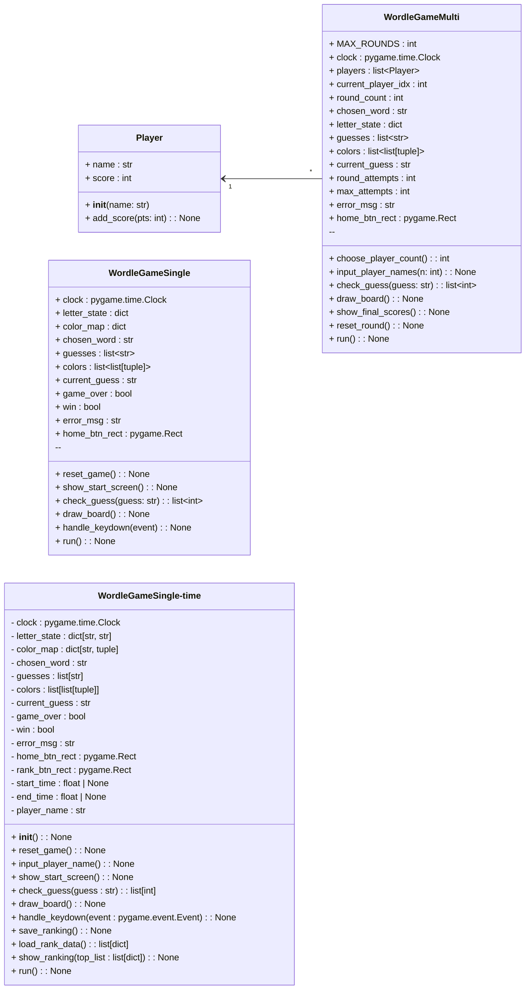

# Wordle – Unified Class Diagram (Multiplayer & Single‑player)

```mermaid
classDiagram
    %% 橫向排列
    direction LR

    class Player {
        + name : str
        + score : int
        + __init__(name: str)
        + add_score(pts: int) : None
    }

    class WordleGameMulti {
        + MAX_ROUNDS : int
        + clock : pygame.time.Clock
        + players : list~Player~
        + current_player_idx : int
        + round_count : int
        + chosen_word : str
        + letter_state : dict
        + guesses : list~str~
        + colors : list~list[tuple]~
        + current_guess : str
        + round_attempts : int
        + max_attempts : int
        + error_msg : str
        + home_btn_rect : pygame.Rect
        --
        + choose_player_count() : int
        + input_player_names(n: int) : None
        + check_guess(guess: str) : list~int~
        + draw_board() : None
        + show_final_scores() : None
        + reset_round() : None
        + run() : None
    }

    class WordleGameSingle {
        + clock : pygame.time.Clock
        + letter_state : dict
        + color_map : dict
        + chosen_word : str
        + guesses : list~str~
        + colors : list~list[tuple]~
        + current_guess : str
        + game_over : bool
        + win : bool
        + error_msg : str
        + home_btn_rect : pygame.Rect
        --
        + reset_game() : None
        + show_start_screen() : None
        + check_guess(guess: str) : list~int~
        + draw_board() : None
        + handle_keydown(event) : None
        + run() : None
    }
    class WordleGameSingle-time {
        %% === 屬性 ===
        - clock : pygame.time.Clock
        - letter_state : dict[str, str]
        - color_map : dict[str, tuple]
        - chosen_word : str
        - guesses : list[str]
        - colors : list[list[tuple]]
        - current_guess : str
        - game_over : bool
        - win : bool
        - error_msg : str
        - home_btn_rect : pygame.Rect
        - rank_btn_rect : pygame.Rect
        - start_time : float | None
        - end_time : float | None
        - player_name : str
        %% === 公開方法 ===
        + __init__() : None
        + reset_game() : None
        + input_player_name() : None
        + show_start_screen() : None
        + check_guess(guess : str) : list[int]
        + draw_board() : None
        + handle_keydown(event : pygame.event.Event) : None
        + save_ranking() : None
        + load_rank_data() : list[dict]
        + show_ranking(top_list : list[dict]) : None
        + run() : None
    }
Player "1" <-- "*" WordleGameMulti
```

---
